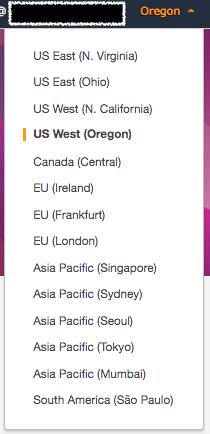
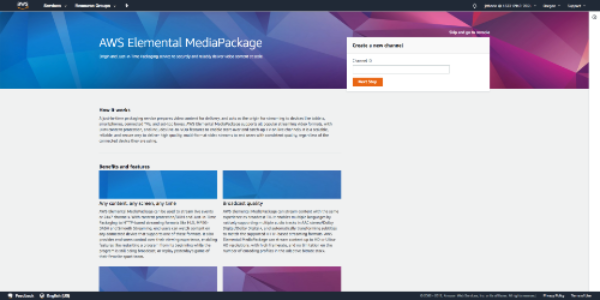
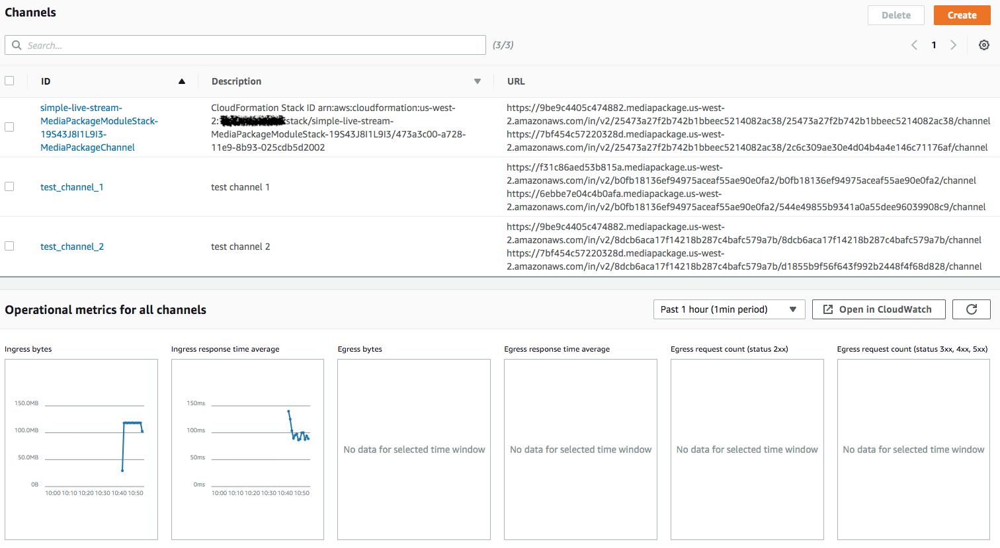
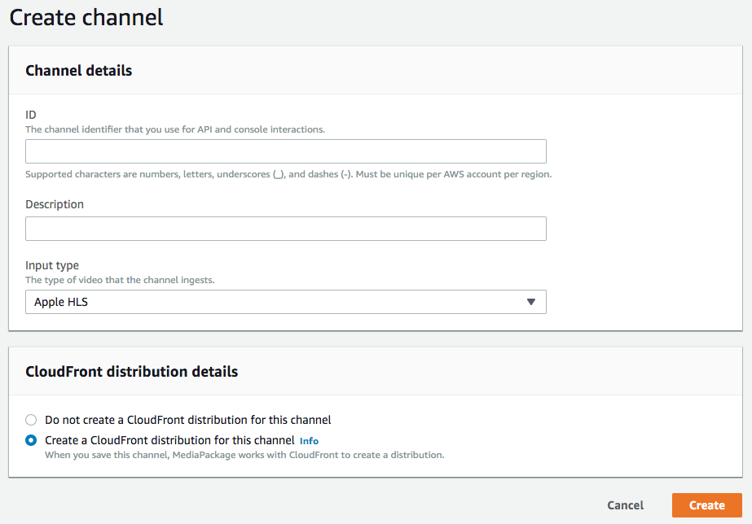
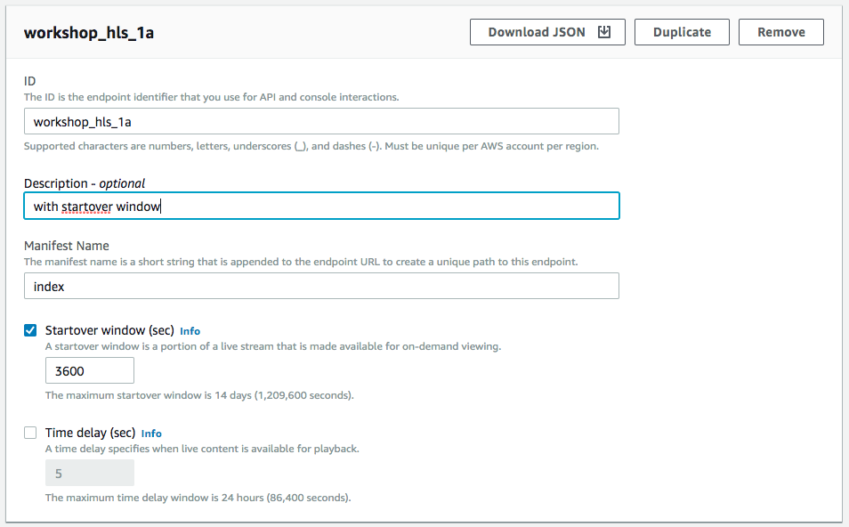
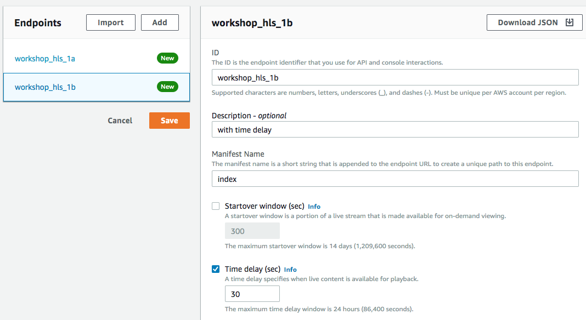
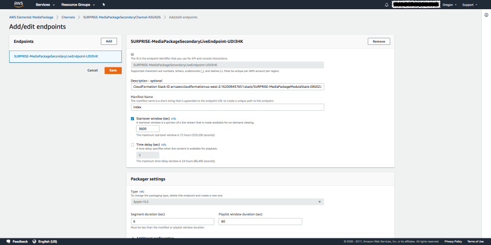

# Module 2: AWS Elemental MediaPackage

In this module, you'll configure AWS Elemental MediaPackage to process an incoming adaptive bitrate (ABR) video and produce an Apple HLS media stream that browsers and mobile devices can consume and play for viewers.

## AWS Elemental MediaPackage Overview

AWS Elemental MediaPackage is a video origination and just-in-time packaging service that allows anyone to securely and reliably deliver streaming content at scale.

In this module, you will use the AWS Console with AWS Elemental MediaPackage to create an ingest channel for receiving live video from AWS Elemental MediaLive and an origin endpoint for packaging and playback to specific device types.

## Prerequisites

### Previous Modules

This module relies on the configuration of IAM and MediaPackage. You must successfully complete these previous modules before attempting this one.

## Implementation Instructions

Each of the following sections provide an overview and detailed, step-by-step instructions. The overview should provide enough context for you to complete the implementation if you're already familiar with the AWS Management Console or you want to explore the services yourself without following a walkthrough.

If you're using the latest version of the Chrome, Firefox, or Safari web browsers the step-by-step instructions won't be visible until you expand the section.

### 1. Sign-in to AWS console

Navigate your browser to https://console.aws.amazon.com/console/home

You may be redirected to a sign-in page. If so, sign-in using the assigned credentials for your account and user.

Choose the **US West (Oregon)** region from the top-right of the AWS Console if the currently selected region is different.

### 2. Navigate to the AWS MediaPackage console

After signing-in, navigate your browser to https://us-west-2.console.aws.amazon.com/mediapackage/home?region=us-west-2

If this is the first time using AWS Elemental MediaPackage, you may see a welcome splash screeen instead of the channel listing. If you see the splash screen you can continue to the channel listing by clicking the link at the top-right area named, **Skip and go to console**.

The channel listing page with configured channels and metric graphs are shown in the image below.

### 3. Create two ingest channels

AWS Elemental MediaLive creates a redundant (dual) channel configuration by default. We will need to create two ingest channels in AWS Elemental MediaPackage to receive both adaptive bitrate streams from AWS Elemental MediaLive.

**Repeat the following steps twice:**

1. From the MediaPackage channel listing page, click the **Create Channel** button at the top-right.
2. Provide a channel ID and short description. Consider using a common ID name for both channels with a suffix of **_1** and **_2**. For example, **live_ingest_1** and **live_ingest_2**.
3. Leave the input type as **Apple HLS**.

See the image below for the Channel Create page.

4. Click the Create Channel button.
5. Once the create operation completes, the next page will show the information for the newly created channel. Copy and save the input URL, the username and password to a text editor or word processor. You will need to click the **Show** link next to the hidden password to display actual characters. 

The next page shows the information for the newly created channel.

Return to the main channel listing page to create the second channel.

**Remember, repeat the previous steps twice so there are two channels**

### 4. Create HLS origin endpoints for each channel

You will create a total of three origin endpoints in this section of the module. You will create two endpoints for the primary AWS Elemental MediaPackage channel and one endpont for the secondary channel. The primary channel will have an origin endpoint with a restart window and a second endpoint with live output that is delayed by five seconds. The secondary AWS Elemental MediaPackage channel will have a single origin endpoint with a restart window.

**Primary channel origin endpoints**

1. Return to the channel listing page for AWS Elemental MediaPackage console. Your page will contain two channels similar to the image shown below.

2. Click the first channel.

3. Click the **Add/edit endpoints** button on the right side of the page.

4. Add an ID for the endpoint. For clarity, it should include the channel ID and the packaging format for the endpoint. For example, a meaningful name could be **workshop_hls_1a**.

5. Check the **Startover window** and set the maximum time to **3600**. This setting will allow a viewer to replay up to 3600 seconds (1 hour) past of streaming video using special parameters.

6. Under **Packager settings**, **Additional configuration**, enable **Ad Markers** by selecting **SCTE-35 enchanced** from the dropdown.

7. Leave all other settings at the default. See the following image for sample inputs for the page.

1. Click the **Add** button at the top-left to add another endpoint.

4. Add an ID for the endpoint. For clarity, it should include the channel ID and the packaging format for the endpoint. For example, a meaningful name could be **workshop_hls_1b**.

5. Check the **Time delay** and set the delay time to **30**. This setting will delay the live playback by 30 seconds. 

7. Leave all other settings at the default. See the following image for sample inputs for the page.

8. Click the **Save endpoints** button.

**Secondary channel origin endpoint**

9. Return to the channel listing page for AWS Elemental MediaPackage console. 

2. Click the second channel.

3. Click the **Add endpoints** button on the right side of the page.

4. Add an ID for the endpoint. For clarity, it should include the channel ID and the packaging format for the endpoint. For example, a meaningful name could be **workshop_hls_2**.

5. Check the **Startover window** and set the maximum time to **3600**. This setting will allow a viewer to replay up to 3600 seconds (1 hour) past of streaming video using special parameters.

7. Leave all other settings at the default. See the following image for sample inputs for the page.

8. Click the **Save endpoints** button.

## Completion

Congratulations!  You have successfully created two AWS Elemental MediaPackage channels for ingest and origin endpoints for playback. Move forward to the next module to configure [**AWS Elemental MediaLive**](../3-MediaLive/README.md).

Return to the [main](../README.md) page.
 
## Cloud Resource Clean Up

To manually remove resources created in this module, go to the AWS Elemental MediaPackage console and remove the endpoints from each channel first, and then remove the channel. AWS Elemental MediaPackage will not allow you to remove a channel with existing endpoints.

