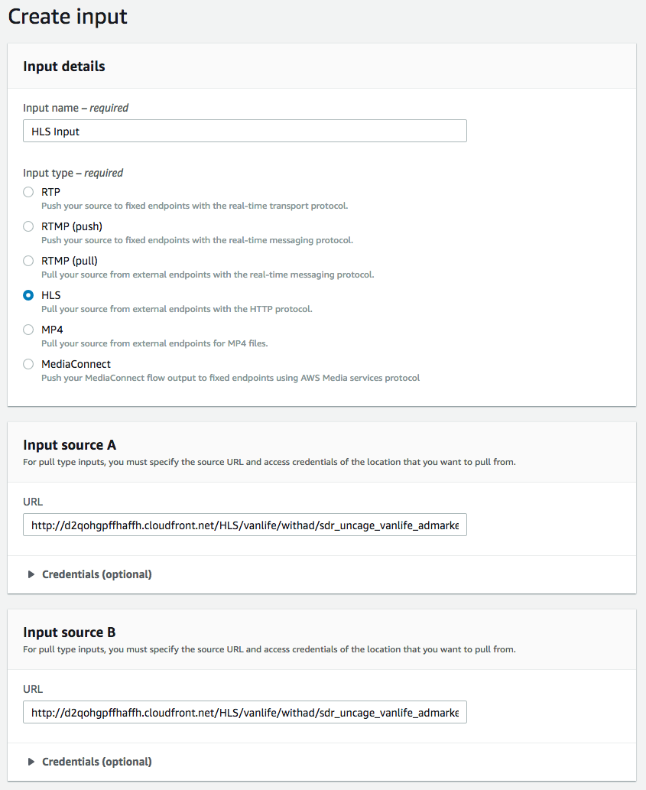
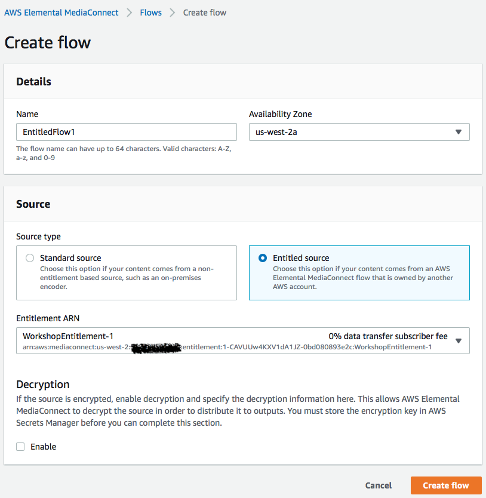
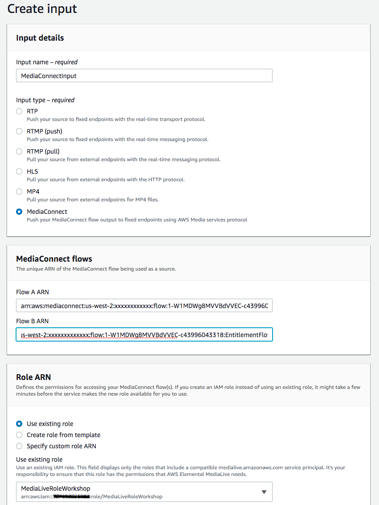
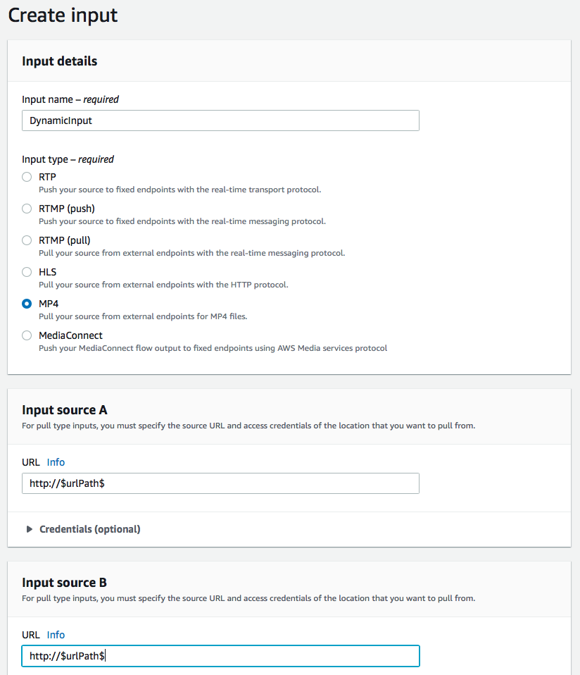
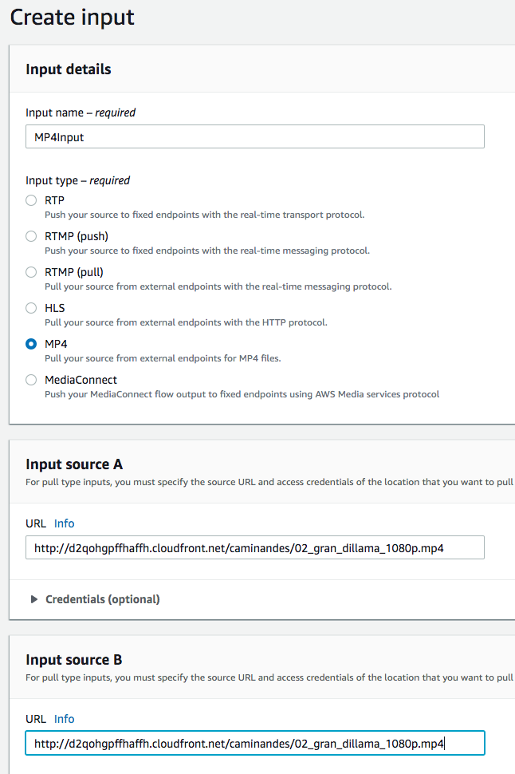
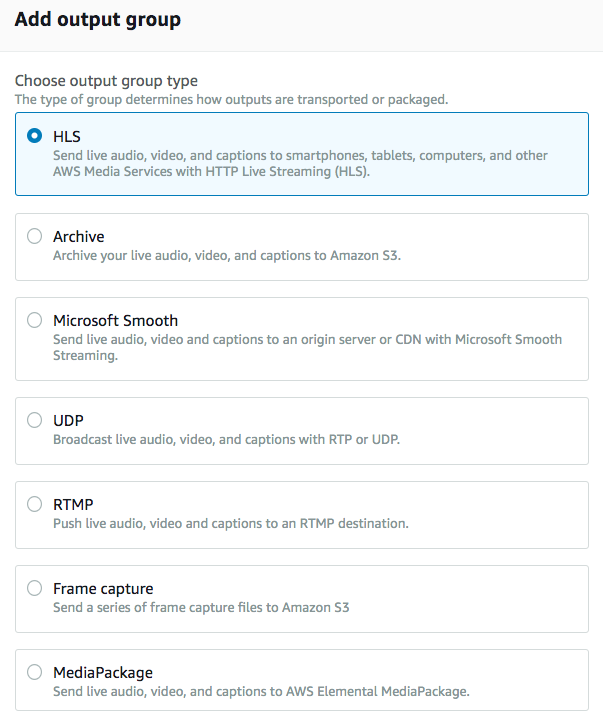
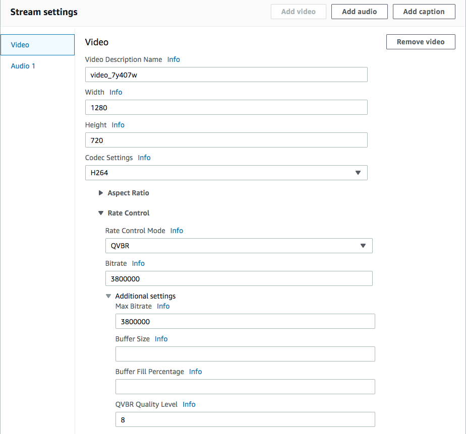

# Module 3: AWS Elemental MediaLive

In this module you'll be creating multiple AWS Elemental MediaLive inputs which will be used as video sources for your AWS Elemental MediaLive channel. During the channel creation, you will need the AWS Elemental MediaPackage endpoints and credentials you have created and saved from the previous module.

## Prerequisites

### Previous Modules

This module relies on the configuration of AWS IAM and AWS Elemental MediaPackage. You must successfully complete these previous modules before attempting this one.

## Implementation Instructions

### 1. Create AWS Elemental MediaLive Inputs

Before you can create a AWS Elemental MediaLive channel, you must first create an input or inputs that the channel can attach to. 

#### Create an HLS Input

1. From the AWS Management Console, choose **Services** then select **AWS Elemental MediaLive** or use the following [link](https://us-west-2.console.aws.amazon.com/medialive/home).
1. On the left navigation pane, click on **Inputs**.
1. Then click on **Create Input**.
1. Enter `HLS Input` for the Input Name.
1. Select `HLS` for Input Type. 

	

1. Under Input Sources, use `http://d2qohgpffhaffh.cloudfront.net/HLS/vanlife/withad/sdr_uncage_vanlife_admarker_60sec.m3u8` for **Input source A**'s Source URL of the stream.
1. Enter the same URL for **Input source B**.
1. Click **Create**.

#### Create a MediaConnect Input
Before you can create a MediaConnect input in MediaLive, we will first need to create a MediaConnect Flow. If you're working on this module during one of our in-person workshops, your account has been previously entitled a live source which you will use as the source for your flow. Otherwise, see this doc on how

1. Navigate to the MediaConnect console.
1. Click on the **Create Flow** button.
1. Give the **Flow** a name like `EntitledFlow`.
1. Under **Source**, select **Entitled source**.
    
1. Under **Entitlement ARN**, select the entitled source from the dropdown. There should only be one. 
1. Click on **Create Flow** button. Your flow will be in a **STANDBY** status. 
1. Click on **Start** button to start the Flow. This will put the flow in an **ACTIVE** status.
1. Note the ARN of this flow. Copy and save it in a text file, as we will use it to create our MediaConnect input.
1. Navigate to the MediaLive console, and click on the **Inputs** link on the left hand side navigation.
1. Click on **Create Input** button.
1. Provide an input name like `MediaConnectInput`.
1. Select **MediaConnect** for input type.
1. Under MediaConnect flows, enter the Flow ARN of the flow you just created for **Flow A ARN**. Leave  **Flow B ARN** blank.
1. Under **Role ARN**, select **Existing Role**, and pick the MediaLive role you previously created from the dropdown. 
1. Click **Create**.
    

#### Create a Dynamic Input
 A dynamic input points to a different file each time it is used in an input switch in the schedule. You can read more about this input type [here](https://docs.aws.amazon.com/medialive/latest/ug/dynamic-inputs.html).
 
1. Navigate to the MediaLive console and click on the Inputs link on the left hand side navigation. 
1. Click on Create Input button.
1. Provide an input name like `DynamicInput`.
1. Select **MP4** for input type.
1. For Input Source A and Input Source B, enter `s3://$urlPath$`.
1. Click **Create** button.
    

#### Create an MP4 Static Input
1. From the MediaLive console, click on the Inputs link on the left hand side navigation.
1. Click on Create Input button.
1. Provide an input name like `MP4Input`.
1. Select **MP4** for input type.
1. For Input Source A and Input Source B, enter `http://d2qohgpffhaffh.cloudfront.net/caminandes/02_gran_dillama_1080p.mp4`.
1. Click **Create** button.
    

### 2. Create an AWS Elemental MediaLive Channel

You will now create an AWS Elemental MediaLive Channel that will publish to the MediaPackage channel you created in a previous module. The MediaLive channel will use the input you created in the previous step.

**Step-by-step instructions**

1. Still on the AWS Elemental MediaLive console, on the left navigation pane, click on **Channels**.

1. Click on **Create channel**.

	

1. Under **General Info**, enter `HLS Stream Channel` for **Channel Name**.

1. For the **IAM Role**, use the default option **Use existing role**. In the dropdown, select the role ARN that was created while working on the IAM module. 

1. On the left navigation pane, under **Input attachments**, click on **Add**.

1. From the **Input** dropdown, select the `HLS Input` you created earlier. Click on **Confirm**.

1. Scroll down to **General Input Settings**.  Set **Source End Behavior** to `Loop`.

1. Add the rest of the inputs you created earlier by click on **Add** next to **Input Attachments**. 

1. From the **Input** dropdown, select the `MP4 Input` you created earlier. Click on **Confirm**.

1. Repeat the above two steps to add your `Dynamic Input` and `MediaConnect Input`. 

1. On the left navigation pane, under **Output Groups** click on **Add**.

	

1. Under **Add Output Group**, use the selected default option **HLS**. 

1. Click on **Confirm**.

1. Under **HLS group destination A**:
	1. In the **URL** textbox, enter the primary input URL of the MediaPackage channel you created previously.
	1. Expand the **Credentials (optional)** settings. For **Username**, paste the username that goes with the Mediapackage input URL you provided. 
	1. Under **Password**, select **Create parameter**. 
	1. For **Name**, enter `MediaPackage_HLS_Push_1`. 
	1. For **Password**, enter the corresponding password of the username for the Mediapackage input URL you provided.
	1. Click on **Create Parameter**. 

	

1. Under **HLS group destination B**:
	1. In the **URL** textbox, enter the secondary input URL of the MediaPackage channel you created previously.
	1. Expand the **Credentials (optional)** settings. For **Username**, paste the username that goes with the Mediapackage input URL you provided. 
	1. Under **Password**, select **Create parameter**. 
	1. For **Name**, enter `MediaPackage_HLS_Push_2`. 
	1. For **Password**, enter the corresponding password of the username for the Mediapackage input URL you provided.
	1. Click on **Create Parameter**. 

1. Under **HLS Settings**, enter `HLS Stream` for **Name**.

1. Under **CDN Settings**, pick `Hls webdav` from the dropdown. Take the defaults for the rest of the HLS settings.

	

1. Scroll down and expand the **Manifest and Segments** section. Change the default **Segment Length** from `10` to `6`.

1. Scroll down and expand the **Ad Markers** section. Click on **Add ad markers**. Select **ELEMENTAL_SCTE35** from the Hls Ad Markers dropdown. 

1. Scroll back up to **HLS Outputs**, and click on **Add Output** twice. This will add two more outputs, for a total of three. Leave the **Name Modifier** as is.

	

1.  Click on **Settings** for **Output 1**.
	1. Expand the **PID settings** section. 
	1. Change **SCTE-35 Behavior** to **PASSTHROUGH**.
	1. Scroll down to **Stream Settings**. Under **Video**, enter `1280` for **Width** and `720` for **Height** .
	1. Select **H264** for **Codec Settings**.
	1. Expand the **Rate Control** Settings.
	1. Select **QVBR** for **Rate Control Mode**.
	1. Enter `3800000` for **Bitrate**.
	1. Expand the **Additional Settings**. 
	1. Enter `3800000` for **Max Bitrate**.
	1. Enter `8` for the **QVBR Quality Level**.

	

1. On the left navigation pane, click on **Output 2** under **Output Groups**.
	1. Expand the **PID settings** section. 
	1. Change **SCTE-35 Behavior** to **PASSTHROUGH**.
	1. Under **Stream Settings**, **Video**, enter `960` for **Width** and `540` for **Height**.
	1. Select **H264** for **Codec Settings**.
	1. Expand the **Rate Control** Settings.
	1. Select **QVBR** for **Rate Control Mode**.
	1. Enter `2300000` for  **Bitrate**.
	1. Expand the **Additional Settings**. 
	1. Enter `2300000` for **Max Bitrate**.
	1. Enter `7` for the **QVBR Quality Level**.

1. On the left navigation pane, click on **Output 3** under **Output Groups**.
	1. Expand the **PID settings** section. 
	1. Change **SCTE-35 Behavior** to **PASSTHROUGH**.
	1. Under **Stream Settings**, **Video**, enter `640` for **Width** and `360` for **Height** 
	1. Select **H264** for **Codec Settings**.
	1. Expand the **Rate Control** Settings.
	1. Select **QVBR** for **Rate Control Mode**.
	1. Enter `1200000` for **Bitrate**.
	1. Expand the **Additional Settings**. 
	1. Enter `1200000` for **Max Bitrate**.
	1. Enter `6` for the **QVBR Quality Level**.

1. On the left navigation pane, click on **Create Channel**.

1. After the `HLS Stream Channel` has been created, it will reflect an Idle **State**. 

1. Select the channel, and click on **Start**. In a minute or so, the channel will be in a Running **State**.

		
