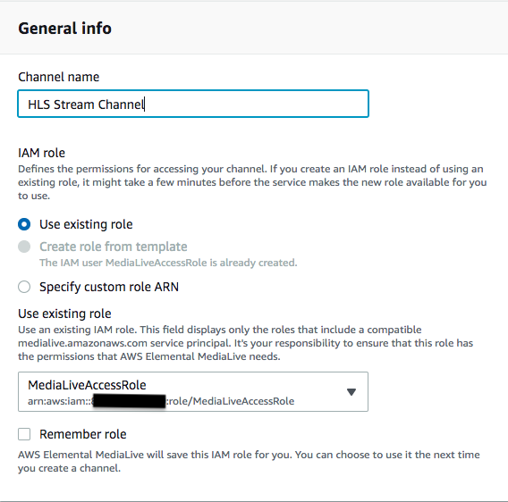
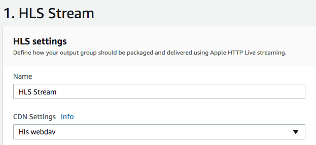

# Module 3: AWS Elemental MediaLive

In this module you'll be creating an AWS Elemental MediaLive input which will in turn get used to set up a AWS Elemental MediaLive channel. During the channel creation, you will need the AWS Elemental MediaPackage endpoints and credentials you have created and saved from the previous module.

## Prerequisites

### Previous Modules

This module relies on the configuration of AWS IAM and AWS Elemental MediaPackage. You must successfully complete these previous modules before attempting this one.

## Implementation Instructions

### 1. Create an AWS Elemental MediaLive Input

Before you can create a AWS Elemental MediaLive channel, you must first create an input that the channel can attach to. 

**Step-by-step instructions**

1. From the AWS Management Console, choose **Services** then select **AWS Elemental MediaLive** or use the following [link](https://us-west-2.console.aws.amazon.com/medialive/home).

1. On the left navigation pane, click on **Inputs**.

1. Then click on **Create Input**.

1. Enter `HLS Input` for the Input Name.

1. Select `HLS` for Input Type. 

	

1. Under Input Sources, use `http://d2qohgpffhaffh.cloudfront.net/HLS/vanlife/withad/sdr_uncage_vanlife_admarker_60sec.m3u8` for **Source A**'s Source URL of the stream.

1. Enter the same URL for **Source B**.

1. Click **Create**.

### 2. Create an AWS Elemental MediaLive Channel

You will now create an AWS Elemental MediaLive Channel that will publish to the MediaPackage endpoints you created in a previous module. The channel will use the input you created in the previous step.

**Step-by-step instructions**

1. Still on the AWS Elemental MediaLive console, on the left navigation pane, click on **Channels**.

1. Click on **Create channel**.

	

1. Under **General Info**, enter `HLS Stream Channel` for **Channel Name**.

1. Copy and paste the Role ARN you saved off while working on the IAM module into the **IAM role ARN**. 

1. Click on **Attach Input** and select the input (`HLS Input`) you created from the **Input** dropdown. 

1. Scroll down to **Input Settings**.  Set **Source End Behavior** to `Loop`.

1. On the left navigation pane, under **Output Groups** click on **Add**.

	

1. Under **Add Output Group**, leave the selection to **HLS**. 

1. Click on **Confirm**.

1. Under **HLS Settings**, enter `HLS Stream` for **Name**.

1. Under **CDN Settings**, pick `Hls webdav` from the dropdown. Take the defaults for the rest of the HLS settings.

	

1. Under **Destination A URL**:
	1. Enter the URL of the first MediaPackage ingest endpoint you created.
	1. Expand the **Credentials (optional)** settings. For **Username**, paste the username that goes with the Mediapackage endpoint you provided. 
	1. Leave the option to **Create new parameter** selected. For **Name**, enter `MediaPackage_HLS_Push_1`. For **Password**, enter the corresponding password of the username for the Mediapackage endpoint you provided.
	1. Click on **Create New Parameter**. 

	

1. Under **Destination B URL**:
	1.  enter the URL of the second MediaPackage ingest endpoint you created.
	1. Expand the **Credentials (optional)** settings. For **Username**, paste the username that goes with the Mediapackage endpoint you provided. 
	1. Leave the option to **Create new parameter** selected. For **Name**, enter `MediaPackage_HLS_Push_2`. For **Password**, enter the corresponding password of the username for the Mediapackage endpoint you provided.
	1. Click on **Create New Parameter**. 

1. Scroll down and expand the **Manifest and Segments** section. Change the default **Segment Length** from `10` to `6`.

1. Scroll down and expand the **Ad Markers** section. Click on **Add ad markers**. Select **ELEMENTAL_SCTE35** from the Hls Ad Markers dropdown. 

1. Under the **HLS Outputs**, click on **Add Output** twice. This will add two more outputs, for a total of three. Leave the **Name Modifier** as is.

	

1.  Click on **Settings** for **Output 1**.
	1. Expand the **PID settings** section. 
	1. Change **SCTE-35 Behavior** to **PASSTHROUGH**.
	1. Scroll down to **Stream Settings**. Under **Video**, enter `1280` for **Width** and `720` for **Height** .
	1. Expand the **Rate Control** Settings.
	1. Enter `3800000` for **Bitrate**.

	

1. On the left navigation pane, click on **Output 2** under **Output Groups**.
	1. Expand the **PID settings** section. 
	1. Change **SCTE-35 Behavior** to **PASSTHROUGH**.
	1. Under **Stream Settings**, **Video**, enter `960` for **Width** and `540` for **Height**.
	1. Expand the **Rate Control** Settings.
	1. Enter `2300000` for  **Bitrate**.

1. On the left navigation pane, click on **Output 3** under **Output Groups**.
	1. Expand the **PID settings** section. 
	1. Change **SCTE-35 Behavior** to **PASSTHROUGH**.
	1. Under **Stream Settings**, **Video**, enter `640` for **Width** and `360` for **Height** .
	1. Expand the **Rate Control** Settings.
	1. Enter `1200000` for **Bitrate**.

1. On the left navigation pane, click on **Create Channel**.

1. After the `HLS Stream Channel` has been created, it will reflect an Idle **State**. 

1. Select the channel, and click on **Start**. In a minute or so, the channel will be in a Running **State**.

		

## Completion

Congratulations!  You have successfully created inputs and channels for AWS Elemental MediaLive to encode video and send to an origin packaging service like AWS Elemental MediaPackage. Move forward to the next module called [**Browser Page**](../4-BrowserPage/README.md) where you will customize an HTML page with a streaming player for one of your AWS Elemental MediaPackage endpoints.
 
Return to the [main](../README.md) page.

## Cloud Resource Clean Up

To manually remove resources created in this module, go to the AWS Elemental MediaLive console and stop the channel. Once the channel is **Idle** delete the channel first, and then delete the input source. AWS Elemental MediaLive will not allow you to remove a channel that is running, nor will it allow you to remove an input that is attached to a channel.
