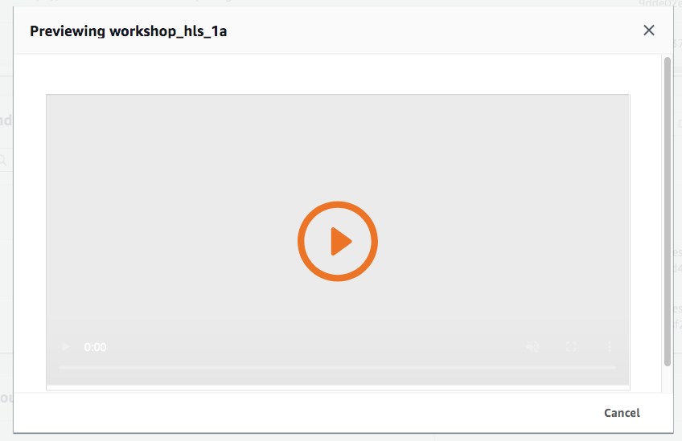
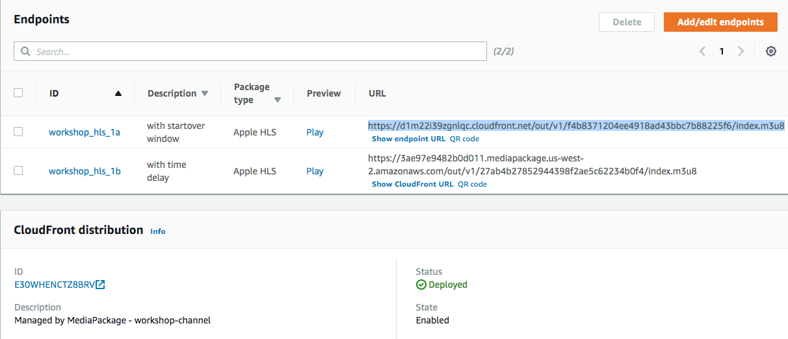

# Video Stream Playback
In this module you will test your playback endpoints to ensure that video is encoded properly by MediaLive and making its way to MediaPackage, your origin. 

## Prerequisites
You must successfully complete these modules before attempting this one:
* [IAM](../IAM/README.md)
* [MediaPackage](../2-MediaPackage/README.md)
* [MediaLive](../3-MediaLive/README.md)

## Test the AWS Elemental MediaPackage HLS Endpoints

### Embedded Player
The AWS Elemental MediaPackage console includes an embedded player for checking the output of any origin endpoints. Each origin endpoint's console compartment will include a link to open the embedded player, a link to the endpoint for playback, a link to its CloudFront URL if CloudFront was enabled, and a link to display a QR code for playback on a mobile device.

To test the MediaPackage endpoints directly, without going through the CloudFront distribution, we can do a video preview using the embedded player in the console. 

1. Navigate to the AWS Elemental MediaPackage console.
2. Select the channel you created previously.
3. Find the origin endpoint on the channel page.
4. Click the Play link under the Preview column to test with the embedded player. See the image below.


The embedded player will launch in a new frame. Press the play icon to start streaming.



#### QR Code
If you have a mobile device that can read QR codes and has HLS playback support, test playback by doing the following:

1. Click the **QR code** link. 
1. Open the Camera app. 
1. Hold your device so that the QR code appears in the viewfinder in the Camera app.
1. Tap notification to open link associated with the QR code.

### Standalone and Web-based Players

You can use a standalone video player to view the HLS endpoints created in the AWS Elemental MediaPackage module, such as QuickTime, VLC or any workstation-based player that supports HLS. 

There are also web-based players, like below, that can stream directly from AWS Elemental MediaPackage endpoints. In all cases, you provide the endpoint or CloudFront URL from AWS Elemental MediaPackage to the player. 

1. https://www.hlsplayer.net/
2. http://videojs.github.io/videojs-contrib-hls/
3. https://developer.jwplayer.com/tools/stream-tester/


### Safari Browser

Safari browsers can play back HLS natively. You simply need to provide the endpoint or CloudFront URL on the browser's address bar to begin playback.

Test this by using the CloudFront URL of your MediaPackage endpoint this time. When using the CloudFront URL, keep in mind that the **CloudFront distribution should be in a deployed state**. If it is deployed and video is not playing back, review the previous two modules.

1. Navigate to the AWS Elemental MediaPackage console.
2. Select a channel you created previously.
3. Find the origin endpoint on the channel page.
4. Click on the **Show CloudFront URL** link. 
5. Select and copy the URL for the endpoint. See the image below.


    
5. Paste the URL into the browser's address bar and hit enter. Playback should begin.


### Endpoint Use for Live and On-Demand

The same origin endpoints can be used for live and on-demand playback from the restart window of AWS Elemental MediaPackage. Recall in previous module for AWS Elemental MediaPackage the restart window for one of the origin endpoints was 3600 seconds (1 hour). By adding parameters to the origin endpoint, you can specify exactly where to start and end playback.

The origin endpoint used alone will automatically play from the live point. Adding **start** and **end** parameters to the URL will cause AWS Elemental MediaPackage to play from the restart window. Here are some examples:

```
https://c4af3793bf76b33c.mediapackage.us-west-2.amazonaws.com/out/v1/9406d427fce145b282d04a68ddd34c44/index.m3u8?start=2019-11-12T02:08:43+00:00&end=2019-11-12T02:09:13+00:00
https://c4af3793bf76b33c.mediapackage.us-west-2.amazonaws.com/out/v1/8e1a636f9a6a489f9582ab2f2930a801/start/2019-11-12T02:10:14-00:00/end/2019-11-12T02:11:14+00:00/index.m3u8
https://c4af3793bf76b33c.mediapackage.us-west-2.amazonaws.com/out/v1/e4b11d69c1374ecc989ed4b7528e5d86/start/1502297760/end/1502297880/index.m3u8
https://c4af3793bf76b33c.mediapackage.us-west-2.amazonaws.com/out/v1/e97781fe36d74cdab3121315df2218c8/index.m3u8?start=1502297460&end=1502297520
```

Remember you can only go back as far as the restart window time and the window is continuously moving. 


## Completion

At the end of the module you learned how to test streaming video endpoints using web and standalone players. You also learned how to access live and restart window streams of the origin service using URL parameters. 

Return to the [main](../README.md) page.
