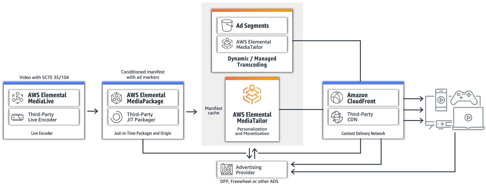
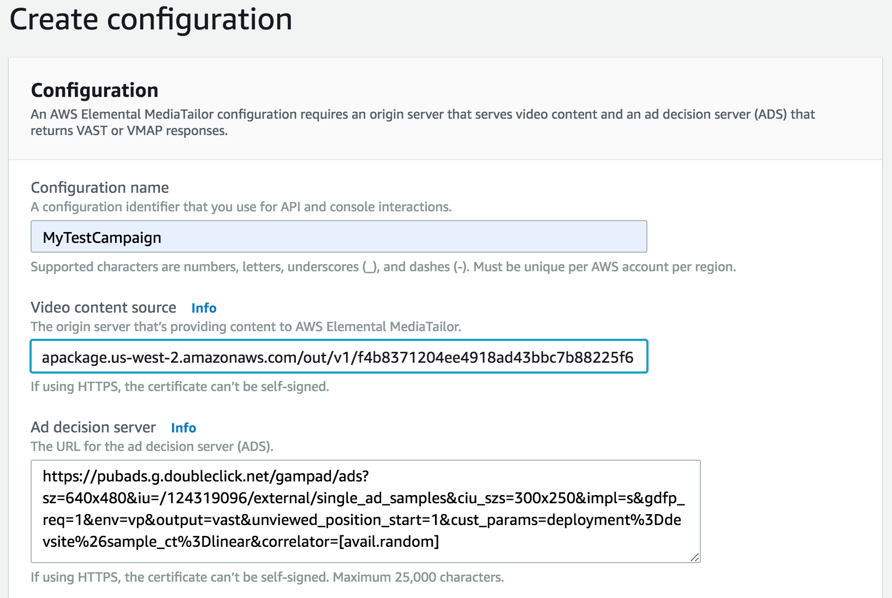

# AWS Elemental MediaTailor
This lab will take you through setting up MediaTailor using other AWS Elemental products like MediaLive and MediaPackage. Once you've completed that, the lab also provides steps on how to integrate MediaTailor with Amazon CloudFront.
	

## Prerequisites
This lab assumes that you have the following:
1. An AWS Elemental MediaLive channel set up to pass through SCTE-35 and pushing content to MediaPackage. Input to the channel must contain SCTE-35 Ad markers. 
1. An AWS Elemental MediaPackage channel set up to receive streams from MediaLive. The channel must have an Endpoint setup that has Ad Markers enabled. The Endpoint URL is needed to integrate with both MediaTailor and Cloudfront. 
1. An Ad Decision Server (ADS). You may use a sample static VAST response XML or a free VAST tag from a commercial ADS like [DoubleClick for Publishers (DFP) by Google](https://developers.google.com/interactive-media-ads/docs/sdks/html5/tags). 

### Previous Modules

This module relies on the configuration of AWS Elemental MediaLive and AWS Elemental MediaPackage. You must successfully complete these previous modules before attempting this one. See Prerequisites.

## Implementation Instructions

### 1. Create an AWS Elemental MediaTailor Configuration 

**Step-by-step instructions**

1. From the AWS Management Console, choose **Services** then select **AWS Elemental MediaTailor**. Make sure you're in the same region as your MediaPackage channel.

1. Click on **Create configuration**.

1. Enter `MyTestCampaign` for the **Configuration  Name**.

1. For the **Video content source**, enter the MediaPackage Endpoint URL with SCTE-35 markers enabled (this would be the endpoint of the primary MediaPackage channel from previous workshop) but  **_without the manifest filename_** . Below is a sample endpoint URL from MediaPackage console. 

	

1. For the **Ad decision server**, you may enter our hosted sample static VAST response: 	http://d2qohgpffhaffh.cloudfront.net/MediaTailor/VASTDemo.xml

	Or use one of the published VAST tags from DFP like the Single Inline Linear tag:

	https://pubads.g.doubleclick.net/gampad/ads?sz=640x480&iu=/124319096/external/single_ad_samples&ciu_szs=300x250&impl=s&gdfp_req=1&env=vp&output=vast&unviewed_position_start=1&cust_params=deployment%3Ddevsite%26sample_ct%3Dlinear&correlator=[avail.random]

	

1. Expand the **Additional configuration** section.

1. Enter `http://d2qohgpffhaffh.cloudfront.net/MediaTailor/AWSE_Logo_15sec.mp4` for your **Slate Ad**. This is the ad that MediaTailor will insert if an ad is too short or unavailable (ADS is unreachable or ad is still being transcoded).

1. Enter `http://d2qohgpffhaffh.cloudfront.net/MediaTailor/HLSPreRollVast.xml` for the **Live pre-roll ad decision server**. This ad will show at the beginning of every new playback session.

	

1. Take the defaults for the rest of the parameters.

1. Click **Create Configuration**. Click on the **Configurations** link to see the configuration you just created. Click on **MyTestCampaign** to see the **Playback endpoints** populated with playback URLs. Note down the **HLS playback prefix** as you'll need it in the next section.

### 2. Test MediaTailor Playback 

1. To verify that ads are making it into your video stream, you may use a standalone video player to view the HLS playback endpoint such as QuickTime, VLC or any workstation-based player that supports HLS. Alternatively, you may use one of the following web-based players to stream your video: 

	* https://www.hlsplayer.net/
	* http://videojs.github.io/videojs-contrib-hls/
	* https://developer.jwplayer.com/tools/stream-tester/

1. Your full playback URL will be the **HLS playback prefix** (eg. _https://f445cfa805184f3e8d86dc2ac1137efa.mediatailor.us-west-2.amazonaws.com/v1/master/cf6421621b389b384c1fd22e51603ee95db76ae0/MyTestCampaign/_)
concatenated with the **manifest filename of your MediaPackage playback endpoint** (eg. _index.m3u8_) 

	Provide the full playback URL to the player of your choice (eg.   _https://f445cfa805184f3e8d86dc2ac1137efa.mediatailor.us-west-2.amazonaws.com/v1/master/cf6421621b389b384c1fd22e51603ee95db76ae0/MyTestCampaign/index.m3u8_)

1. You should see a pre-roll ad about 11 seconds long at the beginning of the playback session. After about 30 seconds of content, you should see ads, before going back to video's main content. 

### 3. Integrate with Amazon CloudFront

**Step-by-step instructions**

#### 3a. Add Origins to Your Distribution
If a CloudFront distribution has previously been created, edit the distribution to match the Origin and Behavior settings described below. Otherwise, it's assumed you're creating a new distribution.

1. From the AWS Management Console, choose **Services** then select **CloudFront**.

1. Click on **Create Distribution**. 

1. Select the **Web** delivery method for your content and hit the **Get Started** button. 

1. Under **Origin Settings**, enter the domain name of your origin for **Origin Domain Name**. In our case, this is the domain name of MediaPackage (eg. _547f72e6652371c3.mediapackage.us-west-2.amazonaws.com_)

1. Under **Origin Policy**, select **HTTPS Only**.

1. Scroll down to **Default Cache Behavior Settings** section. Set **Query String Forwarding and Caching** to **Forward all, cache based on all**.

1. Take the default for all the other settings. Scroll down until you see the **Comment** textbox and enter `CloudFront for MediaTailor`.

1. Click the **Create Distribution** button. This will take you back to the main Distribution page of cloudfront. Your distribution will be in an **In Progress** state. The quickest way to tell which of the Distributions is yours is by the comment you entered. 

1. While your Distribution is still **In Progress**, go ahead and select the same distribution by clicking on its ID. This will take you to its settings. 

1. Go back to the **Origins** tab, and click on the **Create Origin** button. 

1. Enter MediaTailor's hostname for the **Origin Domain Name**. This will come from the **HLS playback prefix** of MediaTailor (e.g. _f445cfa805184f3e8d86dc2ac1137efa.mediatailor.us-west-2.amazonaws.com_)

1. Update the **Origin Protocol Policy** to **HTTPS**. Click **Create**. 

1. Go back to the **Origins** tab, and click on the **Create Origin** button. 

1. Enter MediaTailor's ad server hostname for the **Origin Domain Name**. If MediaTailor is being set up in us-west-2 then the Origin is:
`segments.mediatailor.us-west-2.amazonaws.com`

1. Update the **Origin Protocol Policy** to **HTTPS**.  Click on **Create**.

	

#### 3b. Add Cache Behaviors to Your Distribution

1. Click on the **Behaviors** tab and click on the **Create Behavior** button.

1. Enter `/out/v1/*` for the **Path Pattern**. 

1. Under **Origin or Origin Group**, select the MediaPackage origin. 

1. Set the **Query String Forwarding and Caching** to **Forward all, cache based on all**

1. Click the **Create** button to add another cache behavior. 

1. Click on **Create Behavior** button. 

1. Enter `/v1/*` for the **Path Pattern**. 

1. Under **Origin**, select the MediaTailor origin. 

1. Set **Query String Forwarding and Caching**, to **Forward all, cache based on all**. 

1. Click the **Create** button to add another cache behavior. 

1. Select the **Default** behavior, and click on the **Edit** button.

1. Make sure the **Origin** is pointed to the Ad Server origin (e.g. _segments.mediatailor.us-west-2.amazonaws.com_)

1. Click on **Yes, Edit** button. 

1. Double-check the precedence of the caching behavior as this matters. Your primary precedence should be the MediaTailor origin (precedence 0), followed by the MediaPackage origin (precedence 1), and lastly by the ads origin (which is at Precedence 2 and is the Default). If this is not the precedence reflected, select one of the Behaviors and **Change Precedence** by clicking on either the **Move Up** or **Move Down** button, to make the adjustment. 

	

## Update MediaTailor Configuration with CloudFront Details

1. From the AWS Management Console, choose **Services** then select **AWS Elemental MediaTailor**.

1. Click on the Configuration (`MyTestCampaign`) you created in section 1 and hit the **Edit** button.

1. For the **CDN content segment prefix**, construct your URL by putting together the protocol, the CloudFront **Domain Name**, and the path of the MediaPackage endpoint URL. For example: _https://**d32ftvdskdjq4u.cloudfront.net**/out/v1/96e862ec32d548fabad6436ad4fe0285_

1. For the **CDN ad segment prefix**, construct your URL by putting together the protocol, and the CloudFront  **Domain Name**. For example: _https://d32ftvdskdjq4u.cloudfront.net_

	

## Test MediaTailor Playback with CloudFront

1. Once your CloudFront distribution is in the **Deployed** status, and **Enabled** state, try playing back your stream using the same player you selected in section 2 of this lab. Take your playback URL from Section 2, Step 2 and replace the MediaTailor hostname with the CloudFront **Domain Name** that was assigned to your distribution. 

	For example, if your MediaTailor playback URL is: _https://**f445cfa805184f3e8d86dc2ac1137efa.mediatailor.us-west-2.amazonaws.com**/v1/master/cf6421621b389b384c1fd22e51603ee95db76ae0/MyTestCampaign/index.m3u8_

	then your CloudFront playback URL is:
	_https://**d32ftvdskdjq4u.cloudfront.net**/v1/master/cf6421621b389b384c1fd22e51603ee95db76ae0/MyTestCampaign/index.m3u8_)

## Completion

Congratulations! You've successfully integrated your streaming video with AWS Elemental MediaTailor. In addition, you have successfully integrated MediaTailor with Amazon CloudFront. 

Return to the [main](../README.md) page.

## Cloud Resource Clean Up

### AWS Elemental MediaTailor
Select the configuration you created and hit the **Delete** button to clean up your resources.

### Amazon CloudFront
Select the distribution that you created and hit the **Disable** button. Once the distribution's **State** reflects Disabled, select the same distribution and hit the **Delete** button. 
